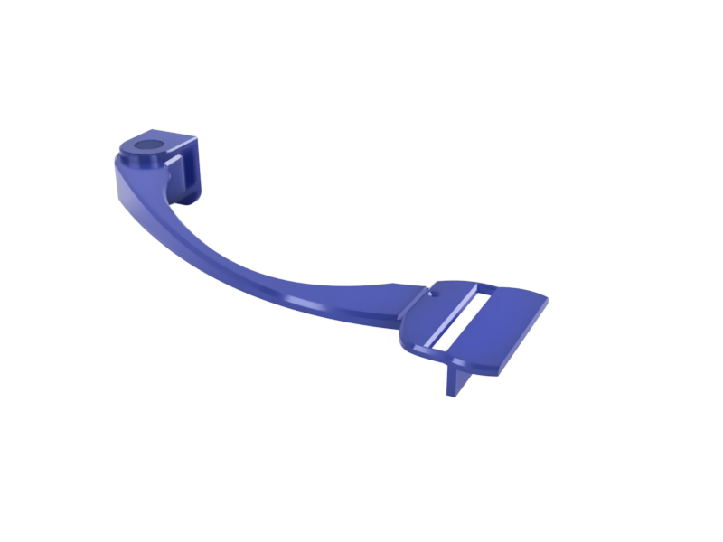

With my current desk setup, I had my webcam installed at the top of my screen. That was way too high. I was almost able to see the top of my head. Using it every day, I decided to get this better arranged by designing at 3d printing a customer webcam holder.

I have designed this webcam holder that can be wall-mounted on the wall behind my screen. I wanted to have my webcam placed on the side of my screen and at around 2/3 of its height.

The webcam holder itself fits a Logitech C525. It might fit other models, but I haven't tested.

[I have shared my design on Thingiverse](https://www.thingiverse.com/thing:4596219). If you want to adapt it to your setup, I have also included my Step file. I have made the original design using Fusion 360.

  <em>
    Photo by{" "}
    <a href="https://unsplash.com/@bernardhermant?utm_source=unsplash&amp;utm_medium=referral&amp;utm_content=creditCopyText">
      Bernard Hermant
    </a>{" "}
    on{" "}
    <a href="https://unsplash.com/s/photos/video-conference?utm_source=unsplash&amp;utm_medium=referral&amp;utm_content=creditCopyText">
      Unsplash
    </a>
  </em>

